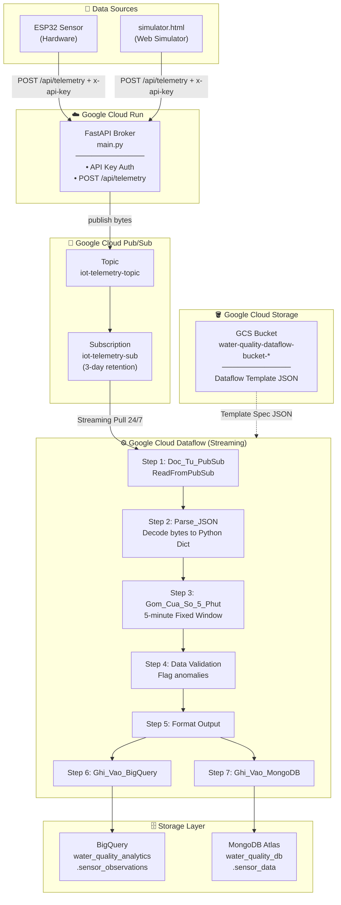
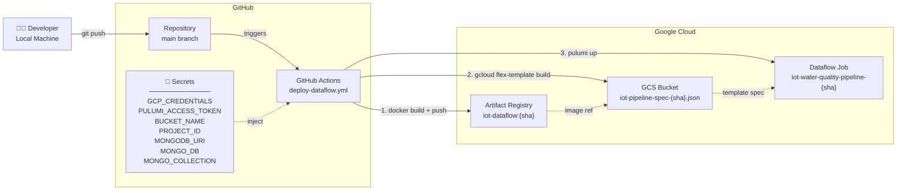
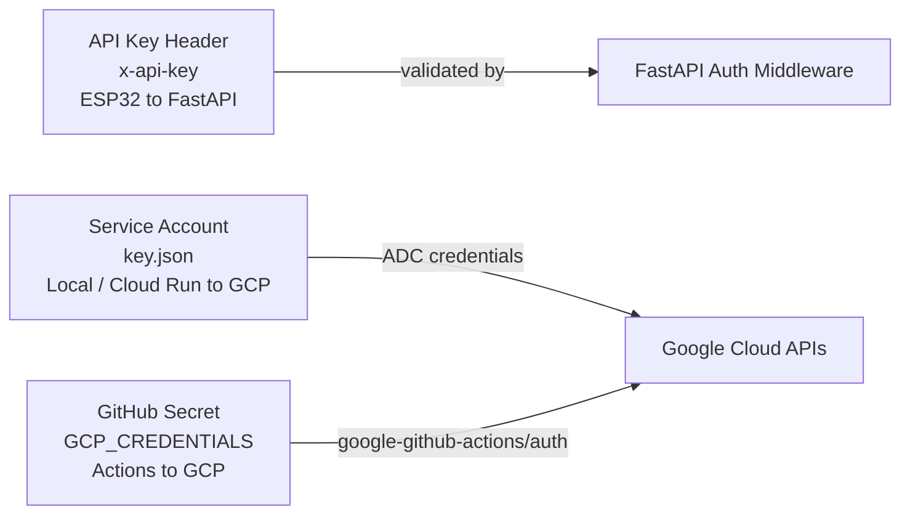

# 🌊 IoT Water Quality Monitoring Pipeline

A real-time data engineering pipeline that collects IoT sensor data (water quality), processes it using Apache Beam on Google Cloud Dataflow, and stores the results in both BigQuery and MongoDB Atlas.

---

## 🏗️ Infrastructure Architecture

### Full System Overview



---

### 🔄 CI/CD Deployment Flow



---

### 🔐 Security Model



---

## 📁 Project Structure

```
DT_demo/
├── 📄 main.py                          # FastAPI broker (Cloud Run)
├── 📄 iot_water_quality_pipeline.py    # Apache Beam pipeline (Dataflow)
├── 📄 index.ts                         # Pulumi IaC (Infrastructure as Code)
├── 📄 metadata.json                    # Dataflow Flex Template parameters
├── 📄 Dockerfile                       # Docker image for Cloud Run (FastAPI)
├── 📄 Dockerfile.dataflow              # Docker image for Dataflow workers
├── 📄 requirements.txt                 # Python dependencies
├── 📄 simulator.html                   # Web UI to send test telemetry
├── 📄 Pulumi.yaml                      # Pulumi project config
├── 📄 .env                             # Local environment variables (gitignored)
└── 📁 .github/
    └── 📁 workflows/
        └── 📄 deploy-dataflow.yml      # GitHub Actions CI/CD pipeline
```

---

## ⚙️ Infrastructure Components (Managed by Pulumi)

| Component | Service | Purpose |
|-----------|---------|---------|
| **GCS Bucket** | Google Cloud Storage | Store Dataflow Flex Template spec JSON files |
| **Pub/Sub Topic** | Google Cloud Pub/Sub | Message queue entry point |
| **Pub/Sub Subscription** | Google Cloud Pub/Sub | Dataflow pull endpoint (3-day retention) |
| **BigQuery Dataset** | Google BigQuery | Analytics data warehouse |
| **BigQuery Table** | Google BigQuery | `sensor_observations` — partitioned by day, clustered by station |
| **Dataflow Job** | Google Cloud Dataflow | Streaming pipeline — Pub/Sub → BigQuery + MongoDB |

---

## 🚀 Quick Start

### Prerequisites
- Google Cloud SDK (`gcloud`)
- Pulumi CLI
- Node.js 18+
- Python 3.10+
- Docker

### Local Development

```bash
# 1. Set environment variables
cp .env.example .env
# Fill in your values in .env

# 2. Run FastAPI locally
pip install -r requirements.txt
uvicorn main:app --reload

# 3. Deploy infrastructure manually
pulumi up
```

### GitHub Secrets Required

| Secret Name | Description |
|-------------|-------------|
| `GCP_CREDENTIALS` | Full content of Service Account `key.json` |
| `PULUMI_ACCESS_TOKEN` | Pulumi Cloud access token |
| `PROJECT_ID` | Google Cloud Project ID |
| `BUCKET_NAME` | GCS bucket name (e.g. `water-quality-dataflow-bucket-a26081e`) |
| `MONGODB_URI` | MongoDB Atlas connection string |
| `MONGO_DB` | MongoDB database name |
| `MONGO_COLLECTION` | MongoDB collection name |

---

## 📊 Data Schema

### BigQuery Table: `sensor_observations`

| Column | Type | Mode | Description |
|--------|------|------|-------------|
| `station_id` | STRING | REQUIRED | Station identifier |
| `timestamp` | TIMESTAMP | REQUIRED | End of 5-min window |
| `PH` | FLOAT | NULLABLE | Average pH value |
| `temperature_c` | FLOAT | NULLABLE | Average temperature (°C) |
| `quality_flag` | STRING | NULLABLE | Data quality assessment flag |

### MongoDB Collection: `sensor_data`
Same schema as BigQuery, optimized for real-time API queries.

---

## 🌐 API Endpoints

**Base URL:** `https://fastapi-iot-broker-899157291449.asia-southeast1.run.app`

### `POST /api/telemetry`

Send sensor data from IoT device.

**Headers:**
```
x-api-key: <your-api-secret>
Content-Type: application/json
```

**Request Body:**
```json
{
  "station_id": "STATION_01",
  "temperature_c": 28.5,
  "PH": 7.4
}
```

**Response:**
```json
{
  "status": "success",
  "message_id": "1234567890"
}
```
