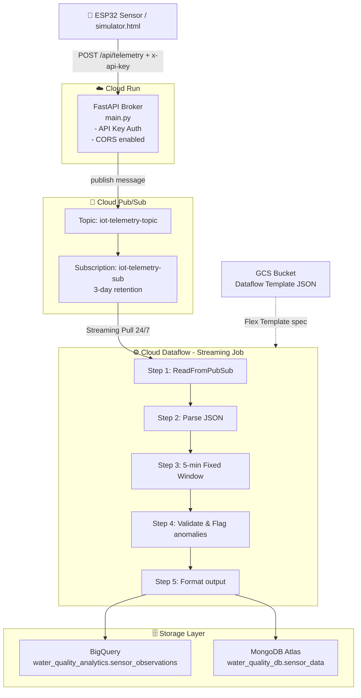
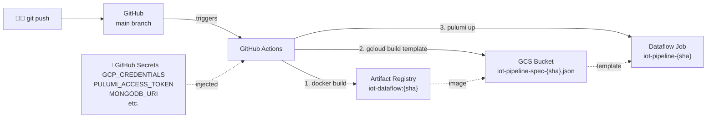
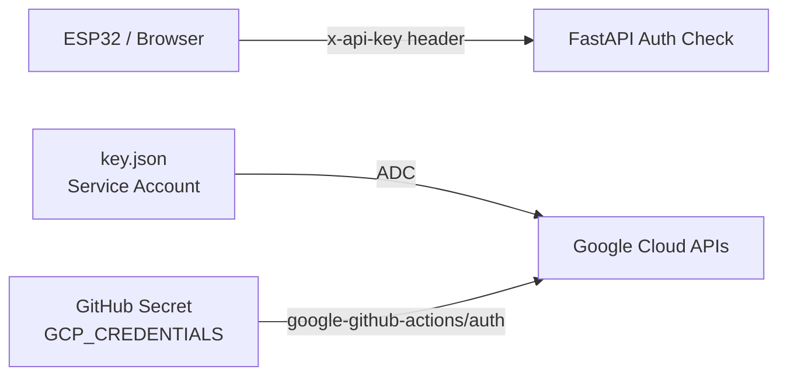

# 🌊 IoT Water Quality Monitoring Pipeline

A real-time data engineering pipeline that collects IoT sensor data, processes it using Apache Beam on Google Cloud Dataflow, and stores results in both BigQuery and MongoDB Atlas.

---

## 🏗️ Infrastructure Architecture

### Data Pipeline Flow



---

### CI/CD Deployment Flow



---

### Security Model



---

## 📁 Project Structure

```
DT_demo/
├── main.py                         # FastAPI broker (Cloud Run)
├── iot_water_quality_pipeline.py   # Apache Beam pipeline (Dataflow)
├── index.ts                        # Pulumi IaC — GCP infrastructure
├── metadata.json                   # Dataflow Flex Template parameters
├── Dockerfile                      # Cloud Run Docker image
├── Dockerfile.dataflow             # Dataflow worker Docker image
├── requirements.txt                # Python dependencies
├── simulator.html                  # Web UI to simulate IoT sensor
├── Pulumi.yaml                     # Pulumi project config
├── .env                            # Local env vars (gitignored)
└── .github/
    └── workflows/
        └── deploy-dataflow.yml     # GitHub Actions CI/CD pipeline
```

---

## ⚙️ GCP Infrastructure (Managed by Pulumi)

| Component | GCP Service | Purpose |
|-----------|-------------|---------|
| GCS Bucket | Cloud Storage | Stores Dataflow Flex Template JSON |
| Pub/Sub Topic | Cloud Pub/Sub | Message queue entry point |
| Pub/Sub Subscription | Cloud Pub/Sub | Dataflow pull endpoint (3-day retention) |
| BigQuery Dataset | BigQuery | Analytics data warehouse |
| BigQuery Table | BigQuery | `sensor_observations` — day-partitioned, station-clustered |
| Dataflow Streaming Job | Cloud Dataflow | Processes Pub/Sub → BigQuery + MongoDB |

---

## 🚀 Getting Started

### Prerequisites

- Google Cloud SDK (`gcloud`)
- Pulumi CLI
- Node.js 18+
- Python 3.10+
- Docker

### Run Locally

```bash
# Install dependencies
pip install -r requirements.txt

# Run FastAPI
uvicorn main:app --reload

# Deploy infrastructure
pulumi up
```

### Required GitHub Secrets

| Secret | Value |
|--------|-------|
| `GCP_CREDENTIALS` | Content of Service Account `key.json` |
| `PULUMI_ACCESS_TOKEN` | Pulumi Cloud token |
| `PROJECT_ID` | GCP Project ID |
| `BUCKET_NAME` | e.g. `water-quality-dataflow-bucket-a26081e` |
| `MONGODB_URI` | MongoDB Atlas connection string |
| `MONGO_DB` | MongoDB database name |
| `MONGO_COLLECTION` | MongoDB collection name |

---

## 📊 Data Schema

### BigQuery: `sensor_observations`

| Column | Type | Mode | Description |
|--------|------|------|-------------|
| `station_id` | STRING | REQUIRED | Sensor station ID |
| `timestamp` | TIMESTAMP | REQUIRED | End of 5-min window |
| `PH` | FLOAT | NULLABLE | Average pH |
| `temperature_c` | FLOAT | NULLABLE | Average temperature (°C) |
| `quality_flag` | STRING | NULLABLE | Data quality flag |

---

## 🌐 API Reference

**Base URL:** `https://fastapi-iot-broker-899157291449.asia-southeast1.run.app`

### `POST /api/telemetry`

**Headers:**

| Header | Value |
|--------|-------|
| `x-api-key` | Your API secret |
| `Content-Type` | `application/json` |

**Request:**
```json
{
  "station_id": "STATION_01",
  "temperature_c": 28.5,
  "PH": 7.4
}
```

**Response:**
```json
{
  "status": "success",
  "message_id": "1234567890"
}
```
